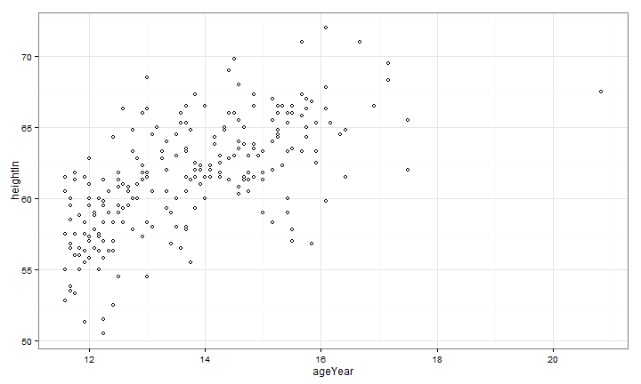
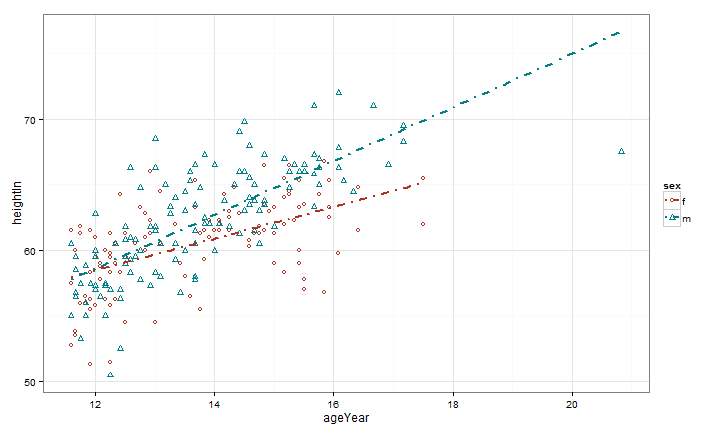

## Motivation

We analyze the gender, age height and weight of a sample data for school children. Here is a initial plot showing age in the x axis and height in the y axis in the dataset.


```r
library(ggplot2)
hw <- read.csv("heightweight.csv")
aes_mapping <- aes_string(x = "ageYear", y = "heightIn")
points <- geom_point(shape = 21, alpha = 1)
p <- ggplot(hw, mapping = aes_mapping) +  
  points + 
  theme_bw() + 
  scale_x_continuous("ageYear") +
  scale_y_continuous("heightIn") +
  scale_colour_hue(l = 40) + 
  scale_shape(solid = FALSE)
```

--- .class #id 

## Motivation

The chart below, shows the distribution as per the code in the previous slide


```r
print(p)
```

 

--- .class #id 

## Model Creation

We can create and use different models to show the impact of one variable has on another. Also, the model can generate as per the gender. Code below creates a linear model with the necessary changes made to incorporate gender.


```r
aes_mapping <- aes_string(x = "ageYear", y = "heightIn", colour = "sex", shape = "sex")
points <- geom_point(solid = FALSE, alpha = 1)

p <- ggplot(hw, mapping = aes_mapping) +
  points +
  theme_bw() +
  scale_colour_hue(l = 40) +
  scale_shape(solid = FALSE)

p <- p + geom_smooth(method = lm, se = FALSE, size = 0.75,
                     linetype = "dotdash")
```

--- .class #id 

## Model Creation

The chart below, shows the distribution as per the code in the previous slide


```r
print(p)
```

 
